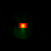

---

<div align="center">    
 
# Unsupervised Learning of Lagrangian Dynamics from Images for Prediction and Control

Yaofeng Desmond Zhong, Naomi Ehrich Leonard | 2020

[](https://papers.nips.cc/paper/2020/hash/79f56e5e3e0e999b3c139f225838d41f-Abstract.html)
[](https://arxiv.org/abs/2007.01926)


</div>
 


This repository is the official implementation of [Unsupervised Learning of Lagrangian Dynamics from Images for Prediction and Control](https://arxiv.org/abs/2007.01926). This implementation is refactored from the original implementation for readability.

## Update
In the 2020 NeurIPS Proceedings, there is an error in Equation (3), which is corrected in [this commit](https://github.com/DesmondZhong/Lagrangian_caVAE/commit/344398729fee806ced57c78ab05a3382ad7dd78d). The main results and conclusion of the paper are not affected. We thank Rembert Daems for spotting the error in Equation (3). The results shown on this page and the notebooks are updated based on training with the correct version of Equation (3). 

The updated pretrained models can be downloaded .

## Requirements

This implementation is written with [PyTorch](https://pytorch.org/) and handles training with [PyTorch-Lightning](https://github.com/PyTorchLightning/pytorch-lightning), which makes our code easy to read and our results easy to reproduce. 

Please use `requirements.txt` to install required dependencies:
```bash
pip install -r requirements.txt
```
In case you encounter problems, we also provide a `requirements_freeze.txt` which contains the output by `pip freeze`.

## Dataset
The data are hosted on Zenodo. [](https://doi.org/10.5281/zenodo.4122270)

Please see  for more details.

## Training

To train the model, run these commands:
```bash
# to train the pendulum example
python examples/pend_lag_cavae_trainer.py 
# to train the fully-actuated cartpole example
python examples/cart_lag_cavae_trainer.py 
# to train the fully-actuated acrobot example
python examples/acro_lag_cavae_trainer.py 
```
The commands above train the model on CPUs. Due to a [bug](https://github.com/pytorch/pytorch/issues/24823) in `torch.nn.functional.grid_sample`, you might encounter a segmentation fault if you train the model on GPUs. This bug has not been fixed in the latest PyTorch version (1.6.0) when this work has been done. 

However, I successfully trained the pendulum example on GPU without error. Thanks to PyTorch-Lightning, you can train it on GPU with 
```bash
python examples/pend_lag_cavae_trainer.py --gpus 1
```

For more details, please check out the .
## Evaluation
To analyze results, please check out the jupyter notebooks in .

## Pre-trained models
Pre-trained models can be downloaded from github releases ( and )

Please unzip the downloaded file and put the checkpoints in .

Thanks to Pytorch-Lightning, after loading the checkpoints, you can check the training hyperparameters in the `hparams` property. For example, please check out the last cell in . 

## Results
The following results can be reproduced by the notebooks in .
### Prediction
Prediction up to 60 time steps. The models here are trained with T_pred=4.
| Examples | True | **Lagrangian + caVAE** | MLPdyn + caVAE | Lagrangian + VAE | HGN
| ---------|:------:|:------------------------:|:----------------:|:------------------:|:-----:|
| Pendulum |  |  |  |  |  |
| CartPole |  |  |  |  |  |

Our model (Lagrangian + caVAE) generate realistic long term prediction.
### Control
One image of each target position is given in each task. The target positions here are inverted positions of the systems.

  

Energy-based controllers are able to conrol the pendulum, fully-actuated CartPole and fully-actuated Acrobot to the target position based on the learned dynamical and embedding (Lagrangian_caVAE) model.

## Acknowledgement
This research has been supported in part by ONR grant #N00014-18-1-2873 and by the School of Engineering and Applied Science at Princeton University through the generosity of William Addy ’82.
Yaofeng Desmond Zhong would like to thank Christine Allen-Blanchette, Shinkyu Park, Sushant Veer and Anirudha Majumdar for helpful discussions. 

This implemention uses  by Nicola De Cao for modelling rotational coordiantes. 